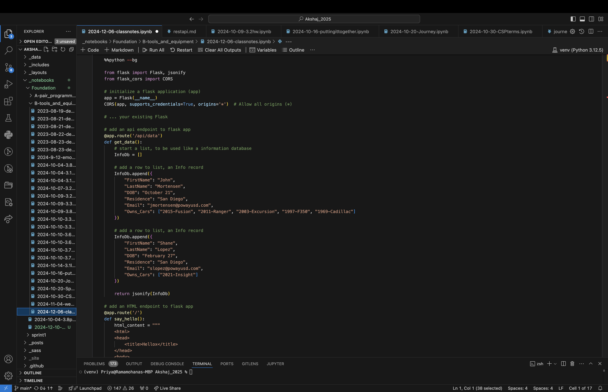
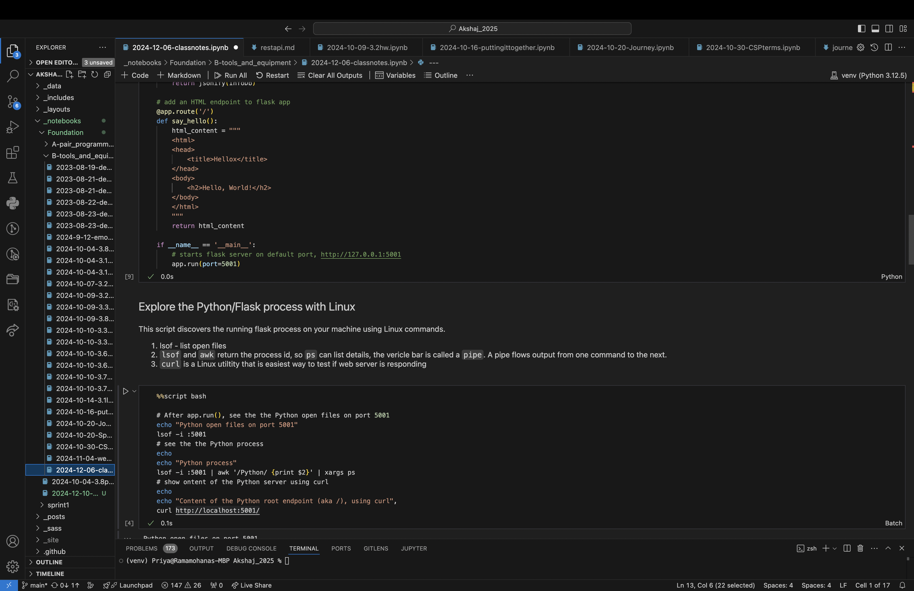
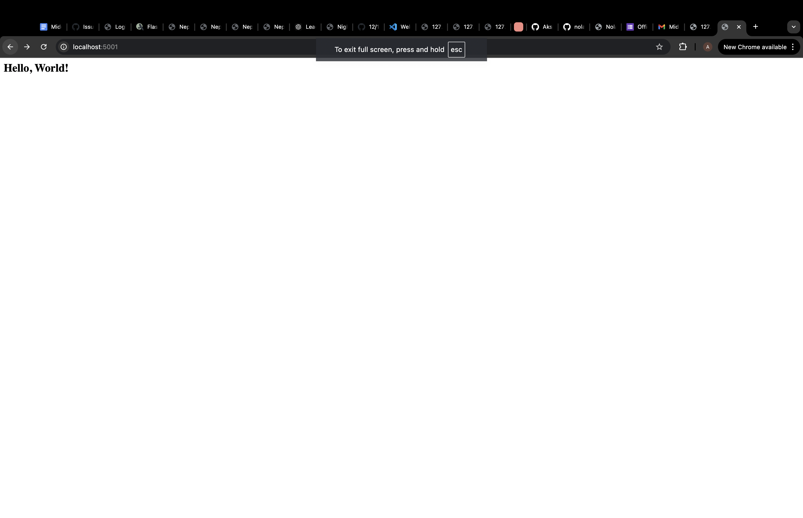
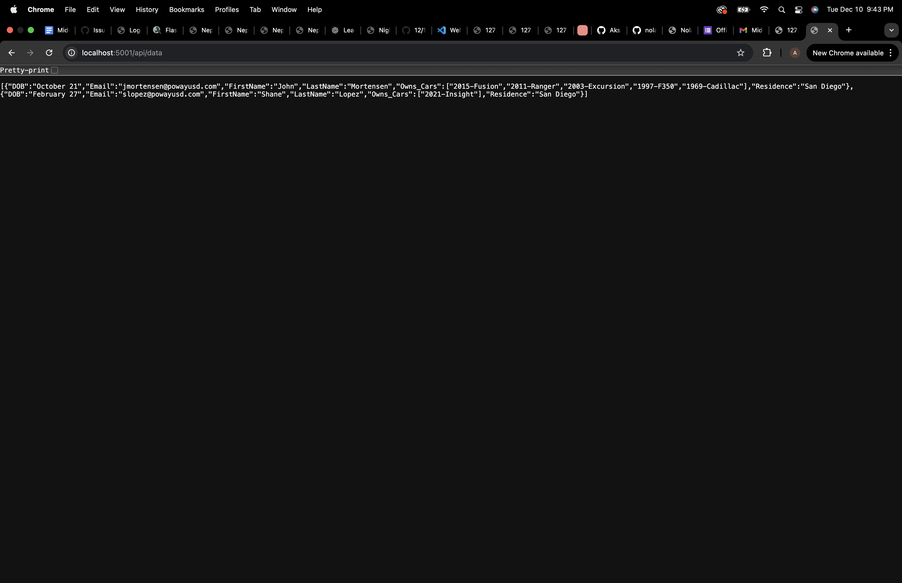
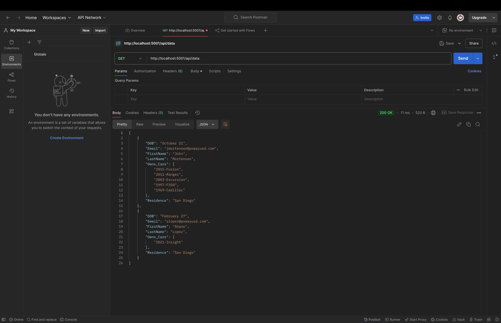
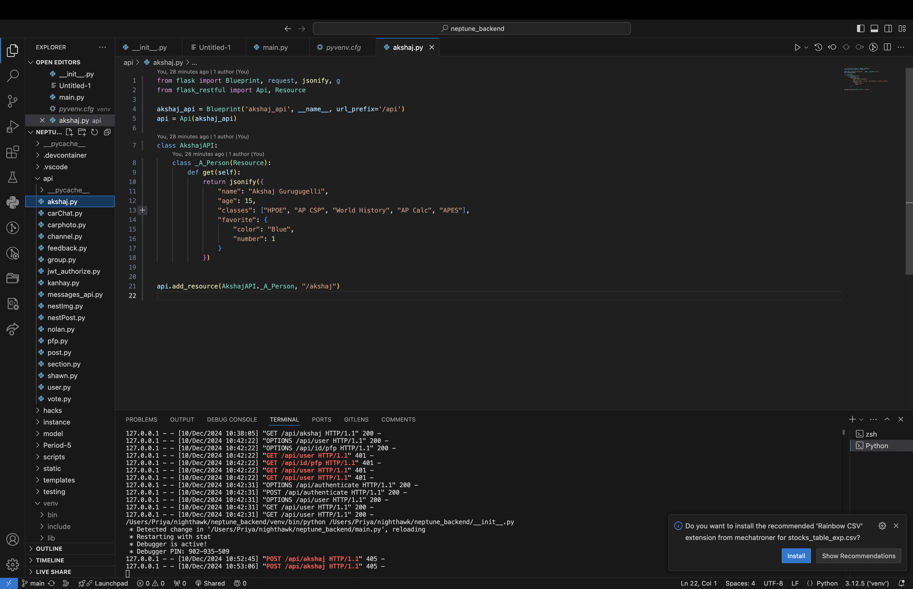
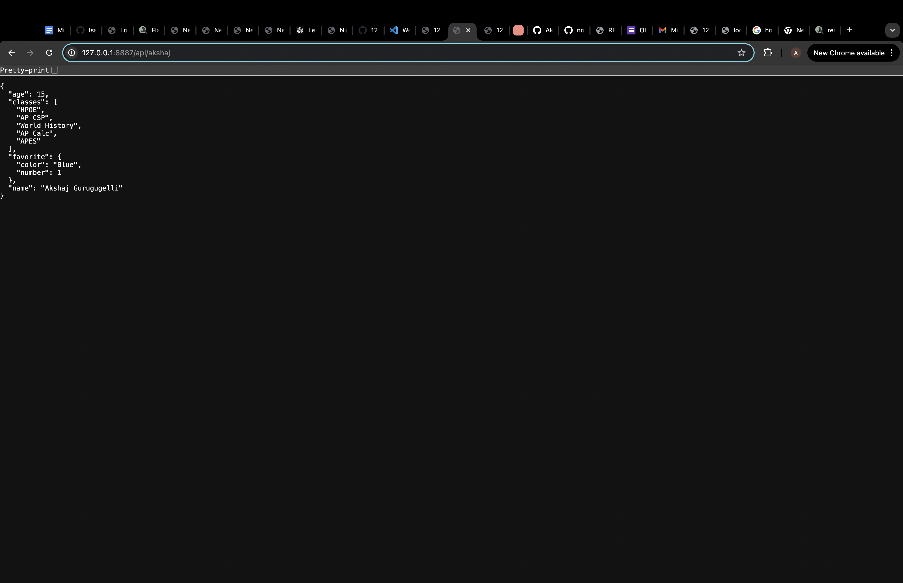
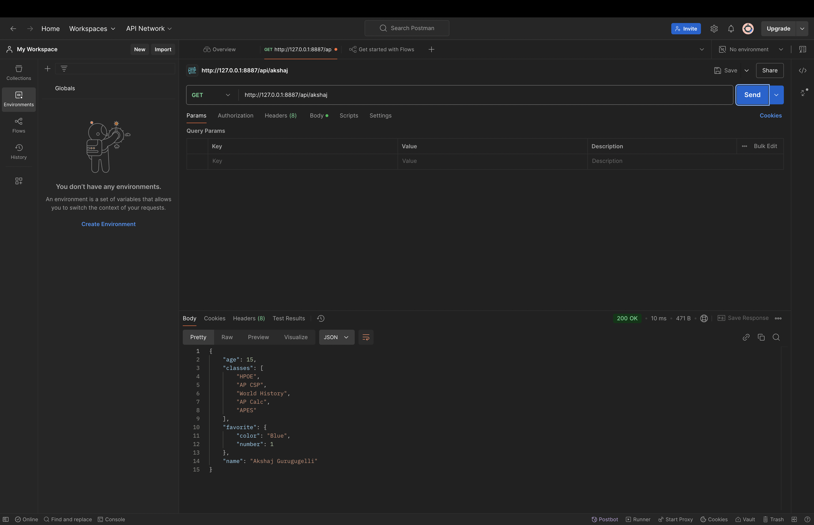

# Testing API On Little Server

----------------------------

  

  

  

  

  

  

  

  

  
---------------------------

  # Testing API On Big Server

----------------------------
  

  

  

  

  

  
----------------------------

