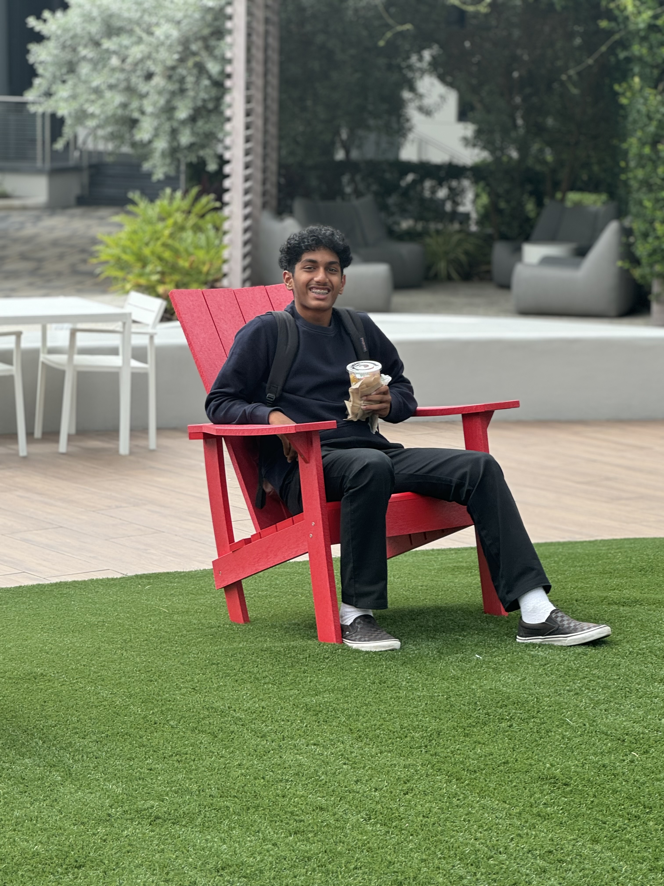

Creator of Student 2025

# Who am I?
> Hi my name is Akshaj, I'm a sophomore at Del Norte High School. I'm 15 years old. I have dad, mom and a brother who is 7 years old.

---

<!--  - correct format -->

# Why am I interested in Computer Science
 > I am enrolled in Computer Science Principles, due to my interest in learning and further pursuing a career in Technology. 

>>The computer science skills I learn from this class would be valuable as I want to use it to assist me in future projects. I want to combine my interest in Finance and Computer Science to create a project. 

# Sports
>- I play on JV Tennis
- I enjoy playing basketball
- I like the 49ers and the golden state warriors
<!-- - Luckily never broke a bone in my body
- I also enjoy watching sports -->

---

<!--  correct format-->

<!--# Clubs/Experience
>- Akshaya Patra - 3rd year
- DECA - 2nd year
- Academic League - 2nd year
- JV Tennis - 2nd year
- Restoring Rainbows - 1st year-->

# Linkedin

>[Connect with me on LinkedIn](https://www.linkedin.com/in/akshaj-gurugubelli-11a66129b/)

>

# My journey so far....

  
   
  <button id="prev-btn">Previous</button>
  <button id="next-btn">Next</button>

