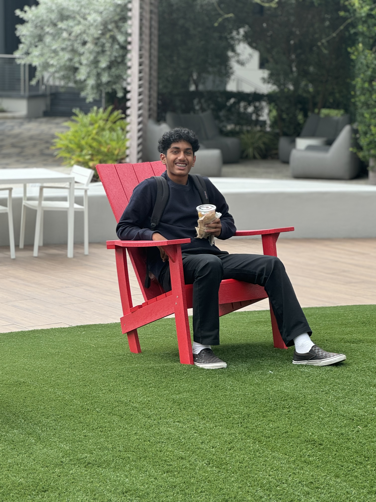
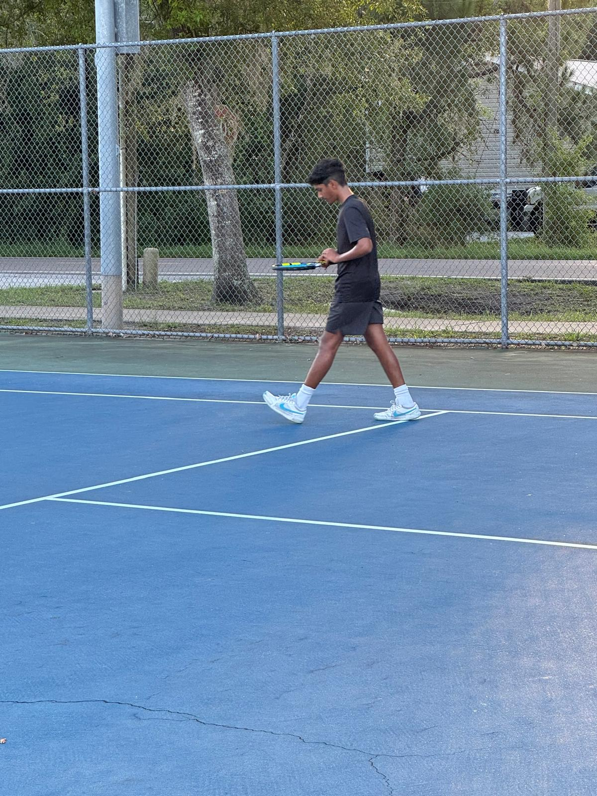

Creator of Student 2025

# Who am I?
> Hi my name is Akshaj, I'm a sophomore at Del Norte High School. I'm 15 years old. I have dad, mom and a brother who is 7 years old

---

# Why am I interested in Computer Science
 > I am enrolled in Computer Science Principles, due to my interest in learning and further pursuing a career in Technology. 

>>The computer science skills I learn from this class would be valuable as I want to use it to assist me in future projects. I want to combine my interest in Finance and Computer Science to create a project. 

# Sports
>- I play on JV Tennis
- I enjoy playing basketball
- Luckily never broke a bone in my body
- I also enjoy watching sports

---

# Clubs/Experience
>- Akshaya Patra - 3rd year
- DECA - 2nd year
- Academic League - 2nd year
- JV Tennis - 2nd year
- Restoring Rainbows - 1st year

